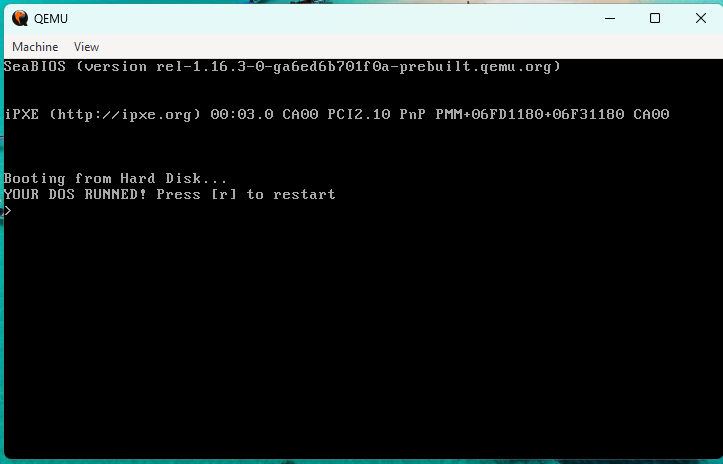

# Simple-DOS
This is a simple DOS made in Assembly

# Costumize
If you want to costumize this code, give credits for us

# Compiling
To run, you can use QEMU, VMware, VirtualBox and other, we compiled with this Batch file

## Screenshot

